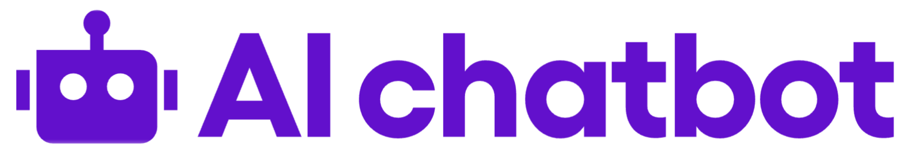

<p align="center">
  
</p>

<p align="center">
	
	
</p>
<p align="center">
		<em>Developed with the software and tools below.</em>
</p>
<p align="center">
  
	
	
  
	<br>
	
	
	
	
	
</p>
<hr>

## What is this for?
This is a Sendbird Chat AI Widget implemented on top of [React UiKit](https://github.com/sendbird/sendbird-uikit-react).

> **NOTE:** Proper utilization through code build is available starting from the "AI Chatbot Pro" plan or higher of [the Sendbird AI Chatbot pricing plan](https://sendbird.com/pricing).


## Demo
- [Live Demo](https://sendbird.github.io/chat-ai-widget/)
- [Sendbird Documentation](https://sendbird.com/docs)

## How to use
1. Prepare Sendbird **Application ID** and **Bot ID**. Here's how you can get them:
   - **Application ID**: If you don't have an account, sign up on the [Sendbird Dashboard](https://dashboard.sendbird.com/) and create a new application.
     

   - **Bot ID**: If you don't have a bot, create one on the Sendbird Dashboard under **AI Chatbot > Manage Bots > Create Bot**.
     

   - You can also find your application ID and bot ID in the Sendbird Dashboard under **AI Chatbot > Manage Bots > Bot Settings > Add to My Website**.

2. Install the library:
   ```bash
   # With npm
   npm install @sendbird/chat-ai-widget
   # Or if you're using yarn
   yarn add @sendbird/chat-ai-widget
   ```

3. Add the import statement and <ChatAiWidget /> component to your code:

   ```jsx
    import { ChatAiWidget } from "@sendbird/chat-ai-widget";
    import "@sendbird/chat-ai-widget/dist/style.css";

    const App = () => {
      return (
        <ChatAiWidget
          applicationId="AE8F7EEA-4555-4F86-AD8B-5E0BD86BFE67" // Your Sendbird Application ID
          botId="khan-academy-bot" // Your Bot ID
        />
      );
    };

    export default App;
    ```
    > Not using React in your environment? You can also load this Chat AI Widget component from an HTML file on your website. Please refer to [js-example.html](./js-example.html) for an example.
  


## Run locally

```bash
yarn install:deps
yarn dev
```

 - If you want to change applicationId and botId when running locally, modify the following variables in `.env`:
   ```
   # Vite prefix is required for Vite to load the env variables
   # Plz modify below two env variables on your needs
   VITE_CHAT_WIDGET_APP_ID=AE8F7EEA-4555-4F86-AD8B-5E0BD86BFE67
   VITE_CHAT_WIDGET_BOT_ID=khan-academy-bot
   ```

## Customization
You can customize the UI of the ChatBot by using the `ChatAiWidget` component. The following are the props that can be used to customize the UI.

```jsx
import { ChatAiWidget } from "@sendbird/chat-ai-widget";
import '@sendbird/chat-ai-widget/dist/style.css';

const App = () => {
  return (
    <ChatAiWidget
      applicationId="Your Sendbird application ID"
      botId="Your Sendbird bot ID"
      // more available props can be found in the next section
    />
  );
};

export default App;
```

### Available props
| Prop Name               | Type                                    | Required | Default Value | Description                                                                                                    |
|-------------------------|-----------------------------------------|----------|---------------|----------------------------------------------------------------------------------------------------------------|
| `applicationId`         | `string`                                | Yes      | N/A           | Your Sendbird application ID                                                                                   |
| `botId`                 | `string`                                | Yes      | N/A           | Your Sendbird bot ID                                                                                           |                                                                                       |
| `userNickName`          | `string`                                | No       | N/A           | The nickname of the user                                                                                       |                                                                   |
| `enableEmojiFeedback`   | `boolean`                               | No       | `true`        | Enables emoji feedback functionality.                                                                          |
| `enableMention`         | `boolean`                               | No       | `true`        | Enables mention functionality.                                                                                 |
| `deviceType`      | `'desktop' \| 'mobile'`                       | No       | N/A        | Device type to be used in the widget                                                   |
| `stringSet`             | `{ [key: string]: string }`             | No       | N/A           | Customizable string set. Available string sets can be found [here](https://github.com/sendbird/sendbird-uikit-react/blob/main/src/ui/Label/stringSet.ts). |
| `customRefreshComponent` | `{ icon: string, style: React.CSSProperties, width: string, height: string, onClick: () => void }` | No       | N/A           | Customizable refresh component. You can set properties such as `icon`, `style`, `width`, `height`, and `onClick`. |
| `configureSession`      | `() => SessionHandler`                  | No      | N/A           | Function to configure the user session. The example usage can be found [here](./custom-session-guide.md). <br/><br/> Must be used with `userId`.|
| `autoOpen`              | `boolean`                               | No       | N/A        | Determines whether the chatbot widget automatically opens when the browser window is opened.                   |
| `messageInputControls.blockWhileBotResponding` | `boolean \| number` | No | N/A | Allows to control enabled/disabled state of the message input for waiting for the bot's reply mesage. If number value is given, a timer will be set to force unblock the message input. |
| `enableResetHistoryOnConnect`        | `boolean`  | No       | `false`       | Determines whether the chatbot widget history is reset when the user connects. |
| `enableHideWidgetForDeactivatedUser` | `boolean`  | No       | `false`       | Determines whether the chatbot widget is hidden when the user is deactivated.  |

## For internal contributors
- [Release guide](./release-guide.md)
