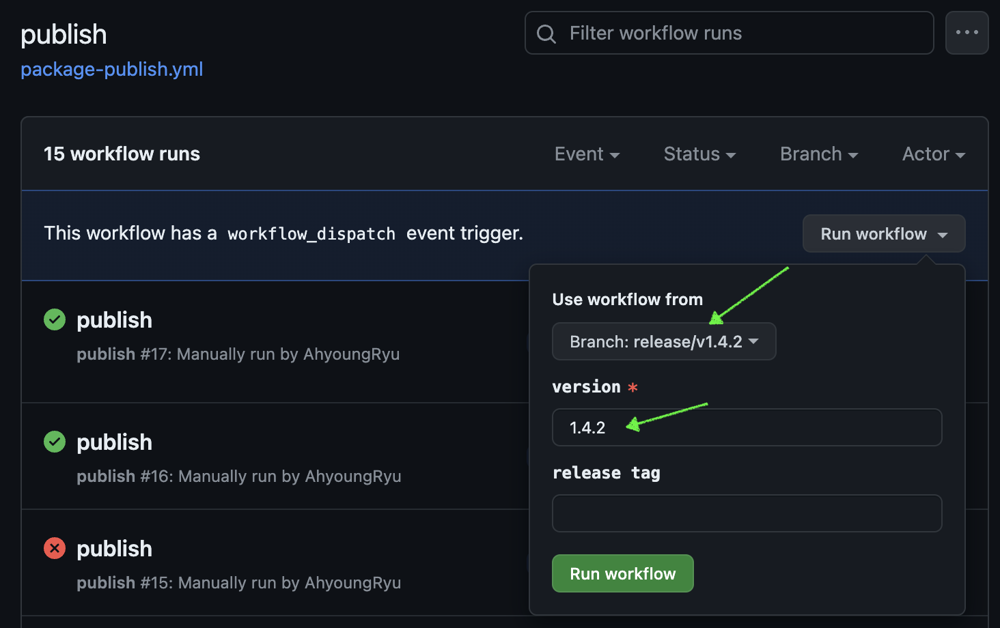

# Release Steps

## Step 0 - Setup (manual handling needed)
1. Create a new branch for the release, its format should be: `release/v{X.X.X}`.
2. Update the `version` field in `package.json`.
3. Write a CHANGELOG for this release.
4. Commit the changes, push them to remote, and create a Pull Request.
5. Comment `/bot create ticket` on the GitHub PR to automatically generate a release ticket.
6. Obtain approval from managers for the ticket before proceeding to the next step.

## Step 1 - Publish a new chat-ai-widget package (using automated workflow)
1. Navigate to Actions -> [Publish Workflow](./.github/workflows/package-publish.yml) in the GitHub repository.
2. Change the target branch to the release branch created in Step 0.
3. Enter the target version (e.g., 1.3.1) in the version field, and specify `rc` / `alpha` / `beta` for the `npm_tag` field if necessary.

4. Hit "Run workflow" button.
5. Once all the steps in the workflow are successfully completed:
   - The build output will be published to npm. (if `npm_tag` is provided, we stop the workflow from here)
   - A commit will be pushed to the release PR created in Step 0. This commit includes:
     - `@sendbird/chat-ai-widget` dependency version updated in `/packages/*`.
   - A new tag(`v{version}`) will be pushed to the origin ~~to trigger the self-service script deployment.~~

## Step 2 - Publish a new self-service script (using automated workflow)
1. Merge the PR created in Step 0.
2. When the release branch is merged into the default branch, the [self-service-publish](./.github/workflows/self-service-publish.yml) workflow will deploy the self-service script.
   - Check the progress in [Circle CI dashboard](https://app.circleci.com/pipelines/github/sendbird/chat-ai-widget).

### Want to publish `@sendbird/chat-ai-widget` manually?
1. Update the `version` field in `package.json`.
2. Run `yarn build:npm` in the directory root.
   - Make sure you have `.env.production` which contains `VITE_CHAT_AI_WIDGET_KEY=...`.
   - `VITE_CHAT_AI_WIDGET_KEY` can be found in 1Password under the entry `CHAT_AI_WIDGET_KEY`.
3. Run `npm publish` (with `--tag rc / alpha / beta` depending on your need).
